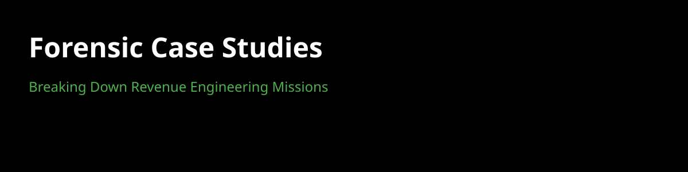

  

## // Value Proposition
Forensic breakdown of revenue engineering missions in MENA. Diagnosing technical debt and deploying algorithmic patches for growth.

## // Case Study Breakdown
1. **Diagnosis**: Analyzing revenue leakage points.
2. **Forensics**: Tracking technical debt in ad/growth stacks.
3. **Patching**: Deploying autonomous agentic fixes.

## // Goal
To productize forensic diagnosis as a standardized Agency-as-a-Service model.
